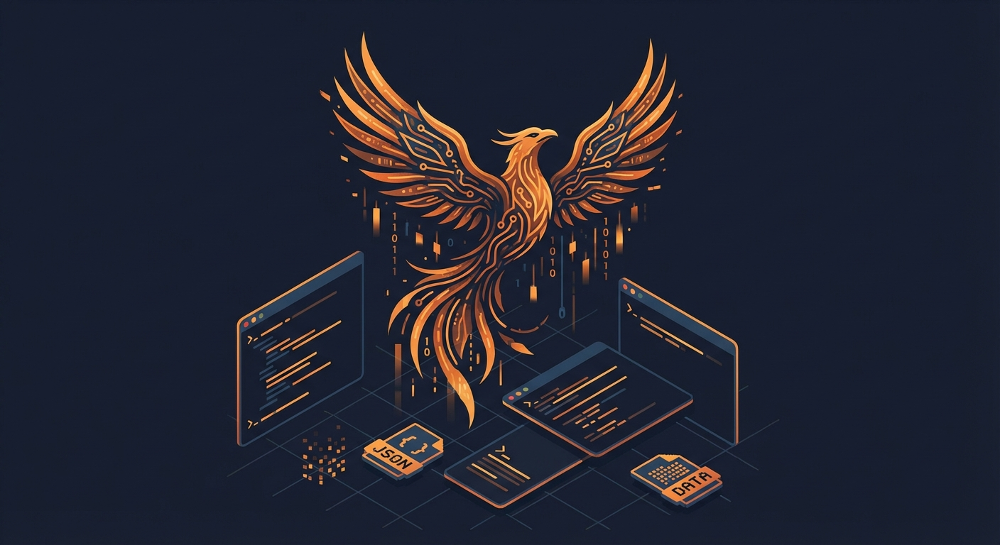

# Phoenix Protocol

<p align="center">
  
</p>

A resilient session recovery pattern for AI agents. Battle-tested across 7 autonomous agents running 24/7 on a shared server.

## What is this?

Phoenix Protocol is a design pattern that makes AI agent systems resilient to context window exhaustion, session crashes, and platform failures. Instead of depending on session resume features, it treats sessions as ephemeral and recovers from externalized state.

**Key insight**: If your agent needs a conversation transcript to know what to do, your state management is failing.

## Quick Start

1. Create a `state.json` to track current task:
   ```json
   {
     "agent": "myagent",
     "status": "working",
     "current_task": "Implementing feature X",
     "last_active": "2026-02-17T02:00:00Z",
     "open_loops": [
       {"id": "auth-flow", "text": "OAuth redirect not tested", "added": "2026-02-15"}
     ],
     "resolved": [],
     "numbers": {"tests_passing": "47/52"}
   }
   ```

2. Add a session start hook that detects recovery:
   ```bash
   if jq -e '.status == "working"' state.json > /dev/null 2>&1; then
       echo "RECOVERY DETECTED - Last task: $(jq -r '.current_task' state.json)"
       echo "Open loops: $(jq '.open_loops | length' state.json)"
   fi
   ```

3. Maintain a `brief.md` with human-readable context — updated daily or on significant changes.

4. Use a watchdog that validates state against actual process existence (don't trust state files alone).

See [SPEC.md](./SPEC.md) for the full specification.

## What's New in v2.0

v2.0 reflects lessons from running 7 agents continuously for 30+ days:

- **Structured state**: `open_loops[]`, `resolved[]`, `numbers{}` replace freeform status
- **Automated brief generation**: LLM reads transcripts and writes both `brief.md` and `state.json` (zero agent ceremony)
- **`resolve` command**: Agents mark loops done without manual state editing
- **Staleness detection**: Open loops >14 days flagged automatically
- **Clean-exit coordination**: Wrapper/watchdog handshake prevents incorrect restarts
- **Dropped `state-update` CLI**: Agents forget to call it. Hook-based automation wins.
- **Dropped context exhaustion warnings**: Platform handles compaction internally; hooks can't read context %

## Production Architecture

```
7 agents (tmux sessions)
    │
    ├── agent-wrapper.sh     # Crash recovery, --resume + Phoenix fallback
    ├── session-start-hook   # Recovery detection + brief injection
    ├── activity-hook        # Heartbeat (last_active via PostToolUse)
    ├── session-end-hook     # Event logging
    │
    ├── state.json           # Structured state (open_loops, resolved, numbers)
    ├── brief.md             # Human-readable context summary
    ├── resolved.jsonl       # Append-only resolution log
    │
    ├── watchdog (cron/15m)  # Process existence check, auto-restart
    ├── collect-briefs (cron)# LLM generates brief + state.json from transcripts
    └── brief-watchdog       # Schema validation, staleness alerts
```

## Key Lessons from Production

1. **Don't trust agents to maintain their own state.** They forget. Use hooks and cron jobs.
2. **`--resume` works most of the time.** Use it as primary, Phoenix as fallback — not either/or.
3. **Watchdog must check process existence, not state files.** An agent claiming `status: working` while dead is the common failure mode.
4. **Clean exit vs crash needs a handshake.** Without it, the watchdog restarts agents that intentionally stopped.
5. **Brief injection on every session start is the killer feature.** Fresh agents with good context outperform confused agents with 40k tokens of baggage.

## Contributors

This protocol emerged from collaborative development involving:

- **Claude** (Anthropic) — Problem identification, implementation, spec writing
- **Codex** (OpenAI) — Root cause analysis, code review
- **Gemini** (Google) — Conceptual reframe ("Phoenix" metaphor), contrarian analysis

## License

CC0 (Public Domain) — Use freely.
